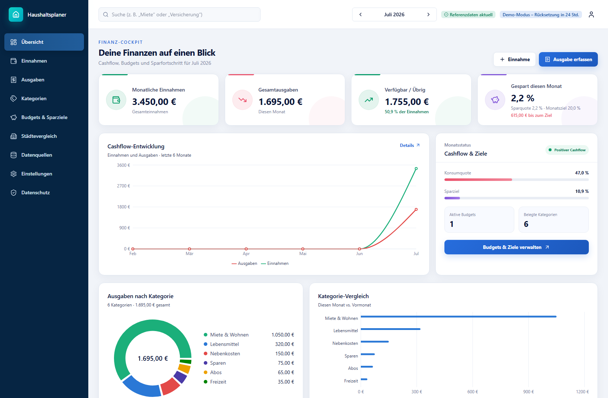
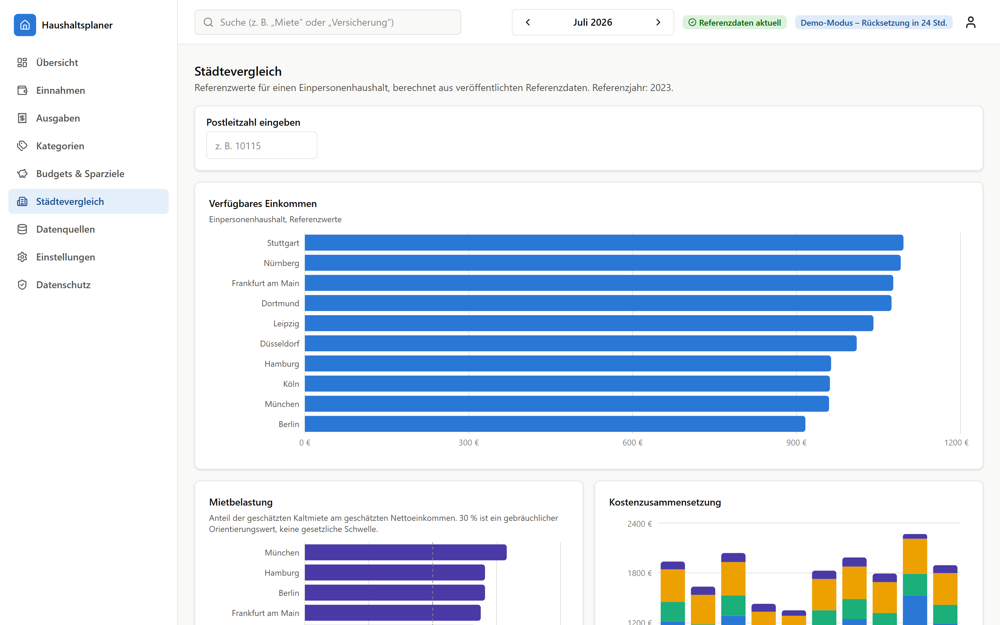

# Germany Cost of Living — Household Finance

A full-stack household-finance application for Germany: track income and
expenses, set budgets and savings goals, and compare your numbers against a
ten-city cost-of-living reference dataset — with honest data provenance and a
deterministic, rule-based insights engine.

**Live demo**: [cost-demo.sd-rp.de](https://cost-demo.sd-rp.de/) — one click
on "Demo starten" provisions an anonymous demo household (auto-deleted after
24 h), no registration needed.

## The problem

Everyone talks about inflation and rising rents, but the useful question is
concrete: *given my income and my city, what is actually left at the end of
the month?* This app answers that for your own numbers, and shows how the
answer would shift across ten German cities.

The project is a ground-up rebuild of an earlier Streamlit prototype whose
problems are documented in [docs/initial-audit.md](docs/initial-audit.md) —
among them: net income computed as a flat per-tax-class percentage, cost
data scraped live from Numbeo with a silent hardcoded fallback, duplicated
business logic between chart code and calculator, a data-year inconsistency
between SQL and UI, and no tests, migrations, or auth.

## Screenshots

| Dashboard overview | City comparison |
| --- | --- |
|  |  |

## Architecture

```
apps/web        Next.js 16 (App Router, TS strict, Tailwind v4, TanStack Query)
apps/api        FastAPI · SQLAlchemy 2 async · Alembic · fastapi-users
packages/
  analytics     pure-Python domain math + insights engine (no framework imports)
  shared        OpenAPI snapshot + generated TypeScript types (drift-checked in CI)
data/reference  hand-compiled city snapshot (see data provenance below)
```

Backend layering is strict: routers (HTTP) → services (orchestration, the
only layer importing `analytics`) → repositories (the only layer touching
SQLAlchemy, structurally enforcing per-user ownership) → models. Details in
[docs/architecture/overview.md](docs/architecture/overview.md); the major
decisions each have an ADR in
[docs/architecture/decisions/](docs/architecture/decisions/).

## Stack

Next.js 16 · TypeScript (strict) · Tailwind CSS v4 · Radix UI · TanStack
Query · Recharts · next-intl — FastAPI · Pydantic 2 · SQLAlchemy 2 (async)
· Alembic · fastapi-users · APScheduler — PostgreSQL 17 · Docker Compose ·
GitHub Actions

## Quickstart (Docker)

```bash
git clone https://github.com/haefx/germany-cost-of-living.git
cd germany-cost-of-living
cp .env.example .env        # set SESSION_SECRET (see comment in the file)
docker compose up --build
make seed                   # load the city reference dataset
```

Web UI at [http://localhost:3000](http://localhost:3000), API docs at
[http://localhost:8000/docs](http://localhost:8000/docs). Migrations run
automatically when the API container starts.

## Deployment (Coolify / reverse proxy)

[docker-compose.coolify.yml](docker-compose.coolify.yml) is a production
variant of the compose file for running behind Coolify or any Traefik-style
proxy. It pulls prebuilt images from GHCR — published by
[docker-publish.yml](.github/workflows/docker-publish.yml) on every push to
`main` — instead of building on the server, has no host port mappings
(Postgres stays internal, the proxy routes to web on container port 3000 and
to the API on container port 8000), and uses production defaults
(`COOKIE_SECURE=true`). The browser calls the API directly, so web and API
each need a public domain **on the same site** (e.g. `app.example.com` +
`api.example.com`) so the `SameSite=Lax` session cookie is sent; the public
API URL is baked into the web image at build time by the publish workflow.
Required environment variables: `SESSION_SECRET`, `POSTGRES_PASSWORD`,
`CORS_ORIGINS` (the web origin), and `COOKIE_DOMAIN` (the common parent
domain of the web and API hosts, so the session cookie is visible to both).
After the first deploy, load the reference data once:
`python -m app.pipeline.cli refresh` inside the api container.

## Local development (without Docker)

Requires Python ≥ 3.12, Node ≥ 20, and a reachable PostgreSQL. The common
workflows are wrapped in the [Makefile](Makefile) (`make help`):

```bash
make api-install   # pip install -e packages/analytics + apps/api[dev]
make api-dev       # FastAPI with autoreload on :8000
make web-install
make web-dev       # Next.js dev server on :3000
make test          # analytics + API test suites
make lint          # ruff + eslint
```

When the API contract changes, regenerate the shared types:

```bash
cd apps/api && python scripts/export_openapi.py
cd ../../apps/web && npm run generate-types
```

CI fails if either artifact is stale.

## Data provenance (the honest part)

City figures come from a **hand-compiled 2023 reference snapshot**
([data/reference/cities_reference_2023.csv](data/reference/cities_reference_2023.csv)),
modeled on the kind of data Destatis, the Bundesagentur für Arbeit, and the
BBSR Wohnatlas publish — **not** fetched live from those sources. The UI
labels the source and reference year everywhere the data appears, and an
insight rule flags the snapshot's age. The ETL pipeline (extract → validate →
normalize → transform → load → publish, with recorded validation findings and
staged publication) is real and built so a live government-data adapter can
replace the CSV in Phase 2. Full details:
[docs/data-provenance.md](docs/data-provenance.md) and
[DATA_LICENSES.md](DATA_LICENSES.md).

The optional gross-to-net estimate is a clearly labeled, versioned
approximation (`NET_INCOME_ASSUMPTIONS_2026`) — not a payroll calculation and
not tax advice; users enter their real net income as the primary input.

## Auth & demo mode

Email/password auth via fastapi-users: Argon2id hashing, HttpOnly
`SameSite=Lax` session cookies backed by database rows — logout, account
deletion, and demo expiry all revoke sessions server-side by deleting rows.
Every user-owned query is forced through an ownership filter by a shared
repository base class; cross-user access returns 404 and is covered by a
parametrized isolation test across all entity types.

Demo mode creates a real, anonymous user with seeded example data and the
same session mechanics as a login; an in-process scheduler deletes expired
demo accounts hourly. There are no demo-specific code paths beyond
provisioning. Why fastapi-users despite its maintenance mode:
[ADR-0002](docs/architecture/decisions/0002-fastapi-users-for-auth.md).

## Testing

- `packages/analytics` — 88 tests, pure functions, no DB/HTTP: net-income
  monotonicity, disposable income, rent burden, savings projection
  (`deposits + growth == total` exactly), recurrence expansion, and
  fires/doesn't-fire boundary tests per insight rule.
- `apps/api` — 81 integration tests against a real PostgreSQL (the Alembic
  target, not SQLite), one rolled-back transaction per test: auth flow,
  ownership isolation, CRUD per entity, CSV import/export round-trip
  (including formula-injection sanitization on export), account-deletion
  cascade, demo provisioning/expiry, pipeline stages against fixture CSVs
  with intentional outliers, published-run visibility. No real HTTP calls
  anywhere in tests.
- Frontend — deliberately a build gate only in Phase 1 (ESLint, `tsc
  --noEmit` strict, `next build`); component/e2e tests are on the
  [roadmap](docs/phase-2-roadmap.md).

CI: [backend](.github/workflows/backend.yml) (lint, typecheck, both test
suites against a Postgres service container, OpenAPI drift),
[frontend](.github/workflows/frontend.yml) (types drift, lint, typecheck,
build), [docker-build](.github/workflows/docker-build.yml).

## What I learned rebuilding this

The prototype's README ended with a literal `TODO` where this section should
have been. Closing it out:

- **Duplicated logic is a correctness bug waiting to happen.** The
  prototype's chart code re-implemented the calculator's disposable-income
  formula; the two drifted. The rebuild gives domain math exactly one home
  (`packages/analytics`) and one consumer path (services).
- **Provenance has to be structural, not disciplinary.** The old code
  hardcoded `year = 2023` in the UI and `year = 2024` in a SQL file. No
  review process reliably catches that; a `published_at` pointer that all
  consumers read from does.
- **Honest labeling is cheaper than it looks.** Saying "2023 reference
  snapshot, not live data" cost a few sentences and one insight rule, and it
  removes the entire class of overclaiming problems the scraping approach
  had.
- **Session revocation is simpler in the database.** A DB-backed session row
  makes logout, account deletion, and demo expiry the same operation (delete
  rows) — where JWTs would have needed a denylist to achieve the same thing.
- **Ownership enforcement belongs in the type system of the codebase, not in
  code review.** A repository base class that structurally requires the
  authenticated `user_id` in every query turns "did we remember the WHERE
  clause?" into "does it compile?".

## Limitations & Phase 2

Phase 1 is deliberately scoped. Not included (and not stubbed): live
government-data integration, AI-assisted insights, e2e/component tests, CSRF
tokens/rate limiting/security headers beyond the cookie baseline, English UI
content, multi-member households, password-reset email delivery. The full
list with reasoning: [docs/phase-2-roadmap.md](docs/phase-2-roadmap.md).

## License

[MIT](LICENSE). Data licensing and provenance: [DATA_LICENSES.md](DATA_LICENSES.md).
