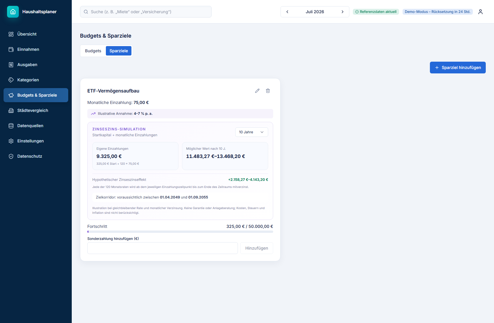

# Haushaltsplaner

Ein modernes Full-Stack-Finanzdashboard für private Haushalte in Deutschland.
Einnahmen, Ausgaben, Budgets und echte Sparbeiträge werden gemeinsam
ausgewertet; ergänzend lassen sich die eigenen Zahlen mit Referenzwerten aus
zehn deutschen Städten vergleichen.

[Live-Demo](https://cost-demo.sd-rp.de/) ·
[Architektur](docs/architecture/overview.md) ·
[Datenherkunft](docs/data-provenance.md)

Die Live-Demo erzeugt mit einem Klick einen anonymen Beispielhaushalt. Das
Konto wird nach 24 Stunden automatisch gelöscht.

## Produkt


Das Dashboard trennt bewusst drei Kennzahlen:

- **Verfügbar / Übrig** ist Einkommen minus Ausgaben.
- **Gespart diesen Monat** zählt nur erfasste Zahlungen der Kategorie
  `Sparen`.
- **Sparziel** ist ein frei konfigurierbarer Monatswert in Euro oder Prozent
  und damit nicht automatisch der gesamte Monatsüberschuss.

Wiederkehrende Buchungen werden für den gewählten Monat anhand ihrer
tatsächlichen Frequenz expandiert. Ein wöchentlicher Eintrag zählt daher je
nach Kalendermonat vier- oder fünfmal.

### Sparziele und Zinseszins



Eine wiederkehrende Sparausgabe kann direkt mit einem Sparziel verknüpft
werden. Die Planung unterstützt:

- monatliche Rate, vorhandenes Startkapital und Sonderzahlungen
- frei wählbaren Zielbetrag und Zieltermin
- Vorlagen für liquide Rücklagen und breit gestreute Aktienanlagen
- Renditekorridore mit monatlicher Verzinsung und Zinseszinseffekt
- Vergleich von eigenen Einzahlungen, möglichem Endwert und reinem
  Renditeeffekt

Renditeangaben sind ausschließlich illustrative Szenarien. Kosten, Steuern und
Inflation sind nicht enthalten; die Darstellung ist keine Anlageberatung.

### Städtevergleich


Der Städtevergleich zeigt verfügbares Einkommen, Mietbelastung und
Kostenstruktur für zehn deutsche Städte. Referenzjahr und Datenquelle bleiben
in der Oberfläche sichtbar, damit Schätzwerte nicht wie Live-Daten wirken.

## Technische Highlights

- Next.js 16 mit App Router, TypeScript strict, Tailwind CSS 4, Radix UI,
  TanStack Query und Recharts
- FastAPI, Pydantic 2, async SQLAlchemy 2, Alembic und PostgreSQL 17
- klar getrennte Router-, Service-, Repository- und Domain-Schichten
- OpenAPI-Vertrag mit automatisch abgeleiteten TypeScript-Typen und
  Drift-Prüfung in CI
- mandantengetrennte Datenzugriffe, Argon2id, serverseitig widerrufbare
  HttpOnly-Sitzungen und sichere Produktionskonfiguration
- CSP, HSTS in Produktion, Frame-Schutz, restriktive Referrer- und
  Permissions-Policy
- CSV-Import mit Vorschau sowie CSV-/JSON-Export
- regelbasierte, nachvollziehbare Finanzhinweise mit Annahmen und Disclaimer
- mehrstufige Docker-Builds, Non-Root-Container und Healthchecks

## Architektur

```text
apps/web        Next.js Dashboard
apps/api        FastAPI, Persistenz und HTTP-Schnittstelle
packages/
  analytics     frameworkunabhängige Finanz- und Prognoselogik
  shared        OpenAPI-Snapshot und TypeScript-Vertrag
data/reference  versionierter Referenzdatensatz
```

Backend-Aufrufe folgen konsequent dem Pfad:

```text
HTTP Router → Service → Repository → PostgreSQL
                    ↘ Analytics
```

Nur Repositories greifen auf SQLAlchemy zu. Nutzerbezogene Abfragen verlangen
strukturell eine User-ID; fremde Objekte liefern 404. Finanzmathematik und
Wiederholungslogik liegen unabhängig von Webframework und Datenbank im
Analytics-Paket.

## Lokal starten

Voraussetzungen: Docker Desktop und Docker Compose.

```bash
git clone https://github.com/haefx/germany-cost-of-living.git
cd germany-cost-of-living
cp .env.example .env
docker compose up --build
docker compose exec api python -m app.pipeline.cli refresh
```

Danach:

- Weboberfläche: [http://localhost:3000](http://localhost:3000)
- API-Dokumentation: [http://localhost:8000/docs](http://localhost:8000/docs)
- API-Healthcheck: [http://localhost:8000/health](http://localhost:8000/health)

Für eine sichere Produktionskonfiguration müssen `SESSION_SECRET` mit
mindestens 32 Zeichen und `COOKIE_SECURE=true` gesetzt sein. Die API verweigert
den Produktionsstart mit unsicheren Standardwerten.

## Entwicklung ohne Docker

Erforderlich sind Python 3.12 oder neuer, Node.js 20 oder neuer und
PostgreSQL.

```bash
make api-install
make web-install
make api-dev
make web-dev
```

Nach Änderungen am API-Vertrag:

```bash
cd apps/api && python scripts/export_openapi.py
cd ../../apps/web && npm run generate-types
```

## Qualitätssicherung

Der aktuelle Stand besteht folgende Prüfungen:

- 88 Domain-Tests für Finanzmathematik, Prognosen, Insights und Wiederholungen
- 86 API- und Integrationstests gegen echtes PostgreSQL
- Ruff, ESLint und TypeScript strict
- optimierter Next.js-Produktionsbuild
- vollständiger Docker-Compose-Build inklusive Alembic-Migrationen

Die Integrationstests decken unter anderem Authentifizierung,
Mandantentrennung, CRUD, wiederkehrende Buchungen, Sparziel-Verknüpfungen,
CSV-Formelschutz, Demo-Löschung und Pipeline-Stufen ab.

## Datenherkunft und Grenzen

Die Stadtwerte stammen aus einem handgepflegten Referenzsnapshot für 2023 in
[`data/reference/cities_reference_2023.csv`](data/reference/cities_reference_2023.csv).
Die Anwendung ruft diese Werte nicht als vermeintliche Echtzeitdaten ab.
Validierung, Normalisierung, Veröffentlichung und Aktualitätsstatus werden in
der Datenpipeline separat geführt.

Die optionale Brutto-Netto-Schätzung basiert auf versionierten Annahmen für
2026 und ersetzt weder eine Lohnabrechnung noch Steuerberatung. Persönliche
Nettoeinnahmen bleiben die maßgebliche Eingabe.

Geplante Erweiterungen und bewusst gesetzte Grenzen sind im
[Roadmap-Dokument](docs/phase-2-roadmap.md) festgehalten.

## Lizenz

[MIT](LICENSE) · Hinweise zu Referenzdaten:
[DATA_LICENSES.md](DATA_LICENSES.md)
